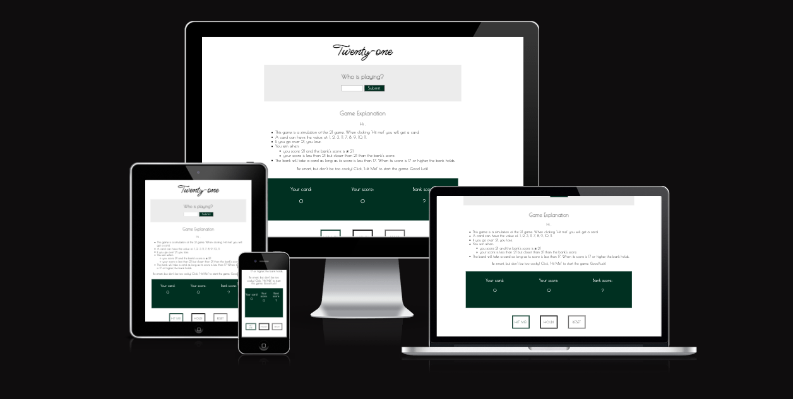
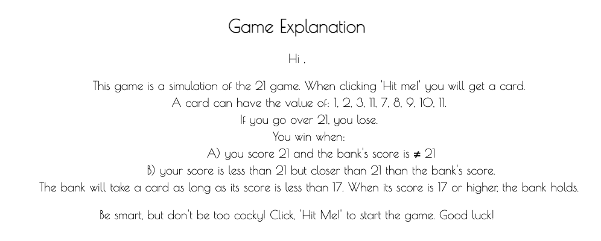
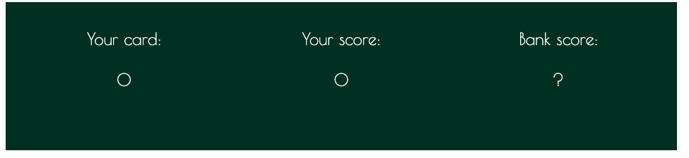
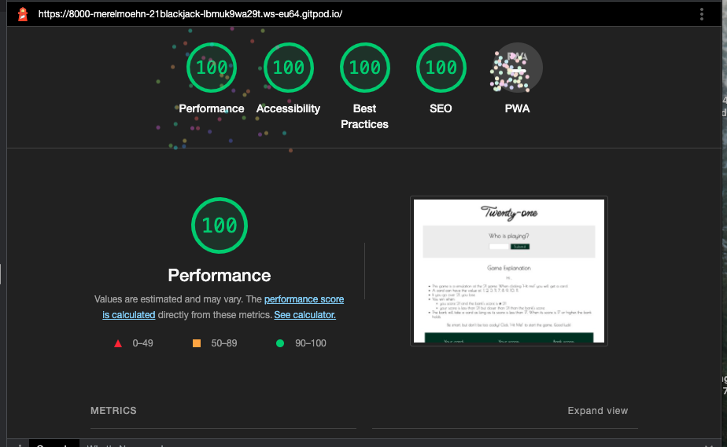

#Twenty-One

Welcome USER_NAME,

In this document I will explain the approach and reason behind the website including an online game Twenty-One. The purpose of this website is let the user enjoy an online game called twenty-one. The goal of the game is to defeat the bank by coming as close to 21 as possible, and definately closer than the bank. However, the user has to be carefull not to be too confident and go over 21. Normally, this game is played with cards. That is why only the numbers: 1, 2, 3, 11, 7, 8, 9, 10, 11. are used. They represent the value of the cards that would be used in real-life. This website is responsive and thus can be accessed via desktop, tablet and mobile phone.

The last update to this file was: **September 22, 2022**

## Pictures and live link
The live project can be viewed by clicking this link: https://merelmoehn.github.io/21game/

## User Experience (UX)
**User stories (first time, returning, frequent)**
The user stories that are at the base of this website are as follows:

* As a user I want to play the online version of twenty-one
* As a user I want to understand how this game works
* As a user I want this experience to be as personal as possible

**Design**
The design of the website is kept minimalistic. Two areas are highlighted to attract the user's attention. That are the section to submit your name and the results area.

The colors used for the website are black, white, green, and grey.

**Features**

* Logo: this directly indicates to the user that this website is about twenty-one.

* Name submit: this functionality gives the user the option to submit his or her name. This will personalize the page and game.

* Explanation section: the explanation section provides the user with the rules of the game.

* Score dashboard: this functionality shows the user his current card, his total score, and at the end: the bank's total score.

* Control buttons: this functionality gives the user to interact with the game via three buttons: Hit me!, Hold! and, Reset.

## Technologies Used
**Languages Used**
* HTML5
* CSS
* JavaScript

## Frameworks, Libraries & Programs Used
* Hover.css: I used hover to give the user feedback when hovering over the menu items and buttons.
* Google Fonts: I used Google Fonts to include two types of fonts: Playfair Display and Sources Sans Pro.
* Git: I used Git for the version control of my code.
* GitHub: I used GitHub for managing my repositories.

## Testing
**Validators**

The W3C Markup Validator and W3C CCS Validator Services, and JigSaw were used to validate every page of the project to ensure there were no syntax errors in the project.
-> Results CSS validator: the CSS passes through the validator without errors.
-> Results Markup Validator: the HTML passes through the validator without errors.
-> Results JSHint validator: the javaScript codes passes through the validator without errors.

**Testing the User Stories from User Experience (UX) section**
* As a user I want to play the online version of twenty-one to enjoy myself: when the user lands on the page it directly sees the logo (indicating that this website is about twenty-one). In addition, the user can scroll down and start the game by clicking the 'Hit me!' button. After that the user can decide to do another round or hold. After the user selects 'hold' the bank's total score is shown and the winner is presented. After that the user can reset the game.
* As a user I want to understand how this game works to have to best chances to win: before the user arrives at the game area he is presented with an explanation section that describes the rules of the game.
* As a user I want this experience to be as personal as possible so that it feels like a true game: the user can enter its name so that the page and game are personalized.

**Bugs found and solved**
* HTML validator: An error was found that I used an h2 in a label function. I removed the h2 out of the label and styled the label in CSS, with the same style rules as for an h2.
* Incorrect outcome 1: after testing my game for the first time I discovered that not always the correct outcome was shown. I added the statement (|| banksTotalScore > 21) in the calculateWinner function to ensure the player wins in the correct situations.
* Incorrect outcome 2: In some occasions the site appointed the player as winner (while having a score of 9), while the computer had a score of 20. I could not see an error in my if statements. The error was appearing because of a timing issue. Instead of getting the bank's score from the DOM I now pass it from playBank() to Calculate() winner. That seems to have solved the error.
* Hold when no card is played: the player was able to press hold while he did not play any card yet (click Hit Me), so I inserted an if statement and alert to ensure the player first plays and then holds.
* HandleBar error: I got an error in my devtools telling me that I needed to pass a string or a Handlebars AST to Handlebars.compile. I did not use handlebars in my code but after deleting a browser extension the error was gone.

## Deployment
**GitHub Pages**
The project was deployed to GitHub Pages using the following steps:
1. I pushed my final code via the terminal after finishing the project.
2. I navigated on GitHub to 'Settings'
3. After Settings I navigated to GitHub Pages
4. There I selected 'Deploy from Branch'
5. Then I selected 'Main/(root)' branch

## Credits
**Code**
* Some of the styling is based on the examples of the Math Loves Project.
* The code for generating a random number out of an array I got from StackOverflow.

**Acknowledgements**
* I want to thank the tutors for guiding me 
* I thank my mentor for his review and feedback on my project
* I thank my fellow students for providing me with suggestions via Slack
* I want to CodeInstitute for the modules that made me capable of writing this code
---

Thank you!